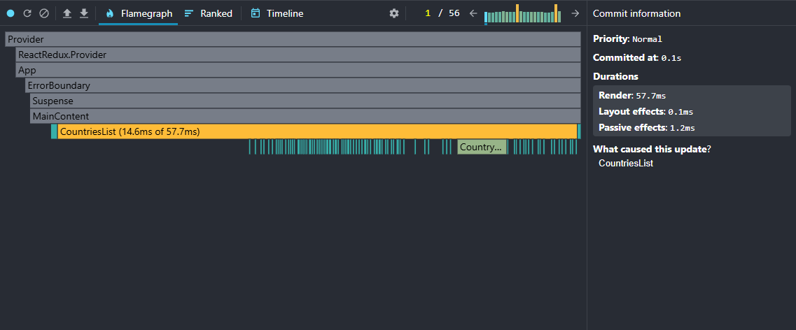
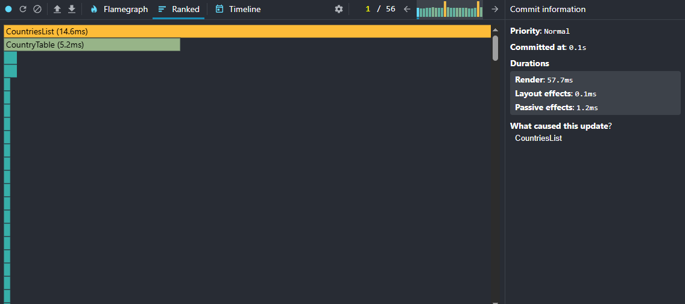

# Performance Profiling

Completed as part of React Performance [task](https://github.com/rolling-scopes-school/tasks/blob/master/react/modules/tasks/performance.md#performance-profiling-task)

Profiling done by using React DevTools Profiler.

Shown difference of such interaction:

- Sorting +
  - by population
  - by country name
- Change year selection
- Filtering by region +
- Searching countries +
- Opening whole table of county +
- Add new column

The initial loading(fetching) that could not be optimized by useMemo or useCallback shown once in this section.

### Initial Loading

#### Commit Duration:

14.3s

#### Render Duration:

296.7ms

#### Interactions:

Profiler not capture interactions so only Commit and Render analyzed

#### Flame Graph:

#### Ranked Chart:

## Before Optimization

### Change year selection

#### Commit Duration:

0.8s

#### Render Duration:

271.2ms

#### Interactions:

Profiler not capture interactions so only Commit and Render analyzed

#### Flame Graph:

#### Ranked Chart:

---

### Filtering by region

#### Commit Duration:

0.2s

#### Render Duration:

110.4ms

#### Interactions:

Profiler not capture interactions so only Commit and Render analyzed

#### Flame Graph:

#### Ranked Chart:

---

### Opening whole table of county

#### Commit Duration:

0.1s

#### Render Duration:

57.7ms

#### Interactions:

Profiler not capture interactions so only Commit and Render analyzed

#### Flame Graph:

#### Ranked Chart:

---

### Sorting by population

#### Commit Duration:

0.5s

#### Render Duration:

327.2ms

#### Interactions:

Profiler not capture interactions so only Commit and Render analyzed

#### Flame Graph:

#### Ranked Chart:

---

### Sorting by country name

#### Commit Duration:

0.9s

#### Render Duration:

320.7ms

#### Interactions:

Profiler not capture interactions so only Commit and Render analyzed

#### Flame Graph:

#### Ranked Chart:

---

### Searching countries

#### Commit Duration:

0.1s

#### Render Duration:

53.5ms

#### Interactions:

Profiler not capture interactions so only Commit and Render analyzed

#### Flame Graph:

#### Ranked Chart:

---

### Add new column

#### Commit Duration:

2.2s

#### Render Duration:

65.5ms

#### Interactions:

Profiler not capture interactions so only Commit and Render analyzed

#### Flame Graph:

#### Ranked Chart:

## After Optimization

### Change year selection

#### Commit Duration:

1s

#### Render Duration:

15.3ms

#### Interactions:

Profiler not capture interactions so only Commit and Render analyzed

#### Flame Graph:

#### Ranked Chart:

---

### Sorting by population

#### Commit Duration:

1s

#### Render Duration:

15.3ms

#### Interactions:

Profiler not capture interactions so only Commit and Render analyzed

#### Flame Graph:

#### Ranked Chart:

---

### Sorting by country name

#### Commit Duration:

0.9s

#### Render Duration:

20.3ms

#### Interactions:

Profiler not capture interactions so only Commit and Render analyzed

#### Flame Graph:

#### Ranked Chart:

