- [Performance Profiling Report](#performance-profiling-report)
  - [Initial Loading](#initial-loading)
    - [Commit Duration:](#commit-duration)
    - [Render Duration:](#render-duration)
    - [Interactions:](#interactions)
    - [Flame Graph:](#flame-graph)
    - [Ranked Chart:](#ranked-chart)
  - [Before Optimization](#before-optimization)
    - [Change year selection](#change-year-selection)
      - [Commit Duration:](#commit-duration-1)
      - [Render Duration:](#render-duration-1)
      - [Interactions:](#interactions-1)
      - [Flame Graph:](#flame-graph-1)
      - [Ranked Chart:](#ranked-chart-1)
    - [Filtering by region](#filtering-by-region)
      - [Commit Duration:](#commit-duration-2)
      - [Render Duration:](#render-duration-2)
      - [Interactions:](#interactions-2)
      - [Flame Graph:](#flame-graph-2)
      - [Ranked Chart:](#ranked-chart-2)
    - [Sorting by population](#sorting-by-population)
      - [Commit Duration:](#commit-duration-3)
      - [Render Duration:](#render-duration-3)
      - [Interactions:](#interactions-3)
      - [Flame Graph:](#flame-graph-3)
      - [Ranked Chart:](#ranked-chart-3)
    - [Sorting by country name](#sorting-by-country-name)
      - [Commit Duration:](#commit-duration-4)
      - [Render Duration:](#render-duration-4)
      - [Interactions:](#interactions-4)
      - [Flame Graph:](#flame-graph-4)
      - [Ranked Chart:](#ranked-chart-4)
    - [Searching countries](#searching-countries)
      - [Commit Duration:](#commit-duration-5)
      - [Render Duration:](#render-duration-5)
      - [Interactions:](#interactions-5)
      - [Flame Graph:](#flame-graph-5)
      - [Ranked Chart:](#ranked-chart-5)
    - [Add new column](#add-new-column)
      - [Commit Duration:](#commit-duration-6)
      - [Render Duration:](#render-duration-6)
      - [Interactions:](#interactions-6)
      - [Flame Graph:](#flame-graph-6)
      - [Ranked Chart:](#ranked-chart-6)
  - [After Optimization](#after-optimization)
    - [Change year selection](#change-year-selection-1)
      - [Commit Duration:](#commit-duration-7)
      - [Render Duration:](#render-duration-7)
      - [Interactions:](#interactions-7)
      - [Flame Graph:](#flame-graph-7)
      - [Ranked Chart:](#ranked-chart-7)
    - [Filtering by region](#filtering-by-region-1)
      - [Commit Duration:](#commit-duration-8)
      - [Render Duration:](#render-duration-8)
      - [Interactions:](#interactions-8)
      - [Flame Graph:](#flame-graph-8)
      - [Ranked Chart:](#ranked-chart-8)
    - [Sorting by population](#sorting-by-population-1)
      - [Commit Duration:](#commit-duration-9)
      - [Render Duration:](#render-duration-9)
      - [Interactions:](#interactions-9)
      - [Flame Graph:](#flame-graph-9)
      - [Ranked Chart:](#ranked-chart-9)
    - [Sorting by country name](#sorting-by-country-name-1)
      - [Commit Duration:](#commit-duration-10)
      - [Render Duration:](#render-duration-10)
      - [Interactions:](#interactions-10)
      - [Flame Graph:](#flame-graph-10)
      - [Ranked Chart:](#ranked-chart-10)
    - [Searching countries](#searching-countries-1)
      - [Commit Duration:](#commit-duration-11)
      - [Render Duration:](#render-duration-11)
      - [Interactions:](#interactions-11)
      - [Flame Graph:](#flame-graph-11)
      - [Ranked Chart:](#ranked-chart-11)
    - [Add new column](#add-new-column-1)
      - [Commit Duration:](#commit-duration-12)
      - [Render Duration:](#render-duration-12)
      - [Interactions:](#interactions-12)
      - [Flame Graph:](#flame-graph-12)
      - [Ranked Chart:](#ranked-chart-12)
  - [Summary](#summary)
    - [Table](#table)

# Performance Profiling Report

Completed as part of React Performance [task](https://github.com/rolling-scopes-school/tasks/blob/master/react/modules/tasks/performance.md#performance-profiling-task)

Profiling done by using React DevTools Profiler.

Shown difference of such interaction:

- Sorting
  - by population
  - by country name
- Change year selection
- Filtering by region
- Searching countries- [Performance Profiling Report](#performance-profiling-report)
  - [Initial Loading](#initial-loading)
    - [Commit Duration:](#commit-duration)
    - [Render Duration:](#render-duration)
    - [Interactions:](#interactions)
    - [Flame Graph:](#flame-graph)
    - [Ranked Chart:](#ranked-chart)
  - [Before Optimization](#before-optimization)
    - [Change year selection](#change-year-selection)
      - [Commit Duration:](#commit-duration-1)
      - [Render Duration:](#render-duration-1)
      - [Interactions:](#interactions-1)
      - [Flame Graph:](#flame-graph-1)
      - [Ranked Chart:](#ranked-chart-1)
    - [Filtering by region](#filtering-by-region)
      - [Commit Duration:](#commit-duration-2)
      - [Render Duration:](#render-duration-2)
      - [Interactions:](#interactions-2)
      - [Flame Graph:](#flame-graph-2)
      - [Ranked Chart:](#ranked-chart-2)
    - [Sorting by population](#sorting-by-population)
      - [Commit Duration:](#commit-duration-3)
      - [Render Duration:](#render-duration-3)
      - [Interactions:](#interactions-3)
      - [Flame Graph:](#flame-graph-3)
      - [Ranked Chart:](#ranked-chart-3)
    - [Sorting by country name](#sorting-by-country-name)
      - [Commit Duration:](#commit-duration-4)
      - [Render Duration:](#render-duration-4)
      - [Interactions:](#interactions-4)
      - [Flame Graph:](#flame-graph-4)
      - [Ranked Chart:](#ranked-chart-4)
    - [Searching countries](#searching-countries)
      - [Commit Duration:](#commit-duration-5)
      - [Render Duration:](#render-duration-5)
      - [Interactions:](#interactions-5)
      - [Flame Graph:](#flame-graph-5)
      - [Ranked Chart:](#ranked-chart-5)
    - [Add new column](#add-new-column)
      - [Commit Duration:](#commit-duration-6)
      - [Render Duration:](#render-duration-6)
      - [Interactions:](#interactions-6)
      - [Flame Graph:](#flame-graph-6)
      - [Ranked Chart:](#ranked-chart-6)
  - [After Optimization](#after-optimization)
    - [Change year selection](#change-year-selection-1)
      - [Commit Duration:](#commit-duration-7)
      - [Render Duration:](#render-duration-7)
      - [Interactions:](#interactions-7)
      - [Flame Graph:](#flame-graph-7)
      - [Ranked Chart:](#ranked-chart-7)
    - [Filtering by region](#filtering-by-region-1)
      - [Commit Duration:](#commit-duration-8)
      - [Render Duration:](#render-duration-8)
      - [Interactions:](#interactions-8)
      - [Flame Graph:](#flame-graph-8)
      - [Ranked Chart:](#ranked-chart-8)
    - [Sorting by population](#sorting-by-population-1)
      - [Commit Duration:](#commit-duration-9)
      - [Render Duration:](#render-duration-9)
      - [Interactions:](#interactions-9)
      - [Flame Graph:](#flame-graph-9)
      - [Ranked Chart:](#ranked-chart-9)
    - [Sorting by country name](#sorting-by-country-name-1)
      - [Commit Duration:](#commit-duration-10)
      - [Render Duration:](#render-duration-10)
      - [Interactions:](#interactions-10)
      - [Flame Graph:](#flame-graph-10)
      - [Ranked Chart:](#ranked-chart-10)
    - [Searching countries](#searching-countries-1)
      - [Commit Duration:](#commit-duration-11)
      - [Render Duration:](#render-duration-11)
      - [Interactions:](#interactions-11)
      - [Flame Graph:](#flame-graph-11)
      - [Ranked Chart:](#ranked-chart-11)
    - [Add new column](#add-new-column-1)
      - [Commit Duration:](#commit-duration-12)
      - [Render Duration:](#render-duration-12)
      - [Interactions:](#interactions-12)
      - [Flame Graph:](#flame-graph-12)
      - [Ranked Chart:](#ranked-chart-12)
  - [Summary](#summary)
    - [Table](#table)

- Add new column

The initial loading(fetching) that could not be optimized by useMemo or useCallback shown once in this section.

### Initial Loading

#### Commit Duration:

14.3s

#### Render Duration:

296.7ms

#### Interactions:

Profiler not capture interactions so only Commit and Render analyzed

#### Flame Graph:

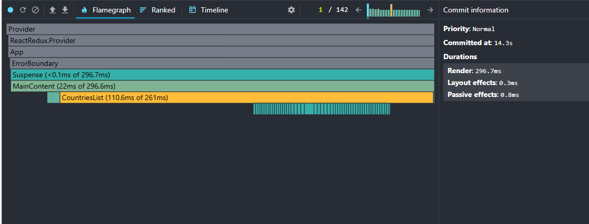

#### Ranked Chart:

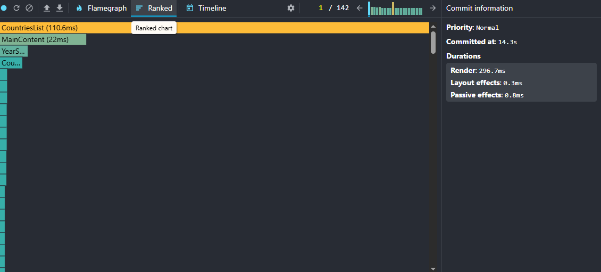

## Before Optimization

### Change year selection

#### Commit Duration:

0.8s

#### Render Duration:

271.2ms

#### Interactions:

Profiler not capture interactions so only Commit and Render analyzed

#### Flame Graph:

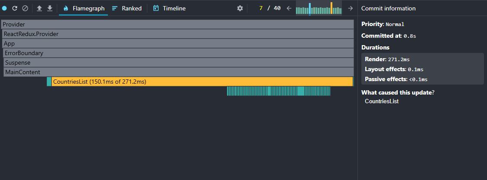

#### Ranked Chart:

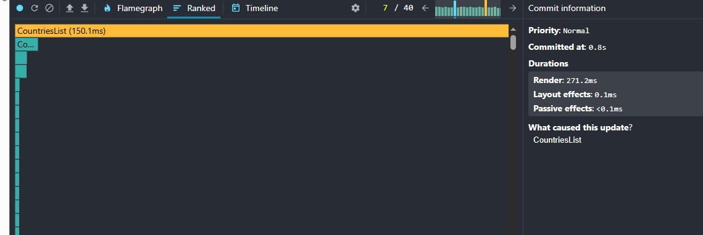

---

### Filtering by region

#### Commit Duration:

0.2s- [Performance Profiling Report](#performance-profiling-report) - [Initial Loading](#initial-loading) - [Commit Duration:](#commit-duration) - [Render Duration:](#render-duration) - [Interactions:](#interactions) - [Flame Graph:](#flame-graph) - [Ranked Chart:](#ranked-chart)

- [Performance Profiling Report](#performance-profiling-report)
  - [Initial Loading](#initial-loading)
    - [Commit Duration:](#commit-duration)
    - [Render Duration:](#render-duration)
    - [Interactions:](#interactions)
    - [Flame Graph:](#flame-graph)
    - [Ranked Chart:](#ranked-chart)
  - [Before Optimization](#before-optimization)
    - [Change year selection](#change-year-selection)
      - [Commit Duration:](#commit-duration-1)
      - [Render Duration:](#render-duration-1)
      - [Interactions:](#interactions-1)
      - [Flame Graph:](#flame-graph-1)
      - [Ranked Chart:](#ranked-chart-1)
    - [Filtering by region](#filtering-by-region)
      - [Commit Duration:](#commit-duration-2)
      - [Render Duration:](#render-duration-2)
      - [Interactions:](#interactions-2)
      - [Flame Graph:](#flame-graph-2)
      - [Ranked Chart:](#ranked-chart-2)
    - [Sorting by population](#sorting-by-population)
      - [Commit Duration:](#commit-duration-3)
      - [Render Duration:](#render-duration-3)
      - [Interactions:](#interactions-3)
      - [Flame Graph:](#flame-graph-3)
      - [Ranked Chart:](#ranked-chart-3)
    - [Sorting by country name](#sorting-by-country-name)
      - [Commit Duration:](#commit-duration-4)
      - [Render Duration:](#render-duration-4)
      - [Interactions:](#interactions-4)
      - [Flame Graph:](#flame-graph-4)
      - [Ranked Chart:](#ranked-chart-4)
    - [Searching countries](#searching-countries)
      - [Commit Duration:](#commit-duration-5)
      - [Render Duration:](#render-duration-5)
      - [Interactions:](#interactions-5)
      - [Flame Graph:](#flame-graph-5)
      - [Ranked Chart:](#ranked-chart-5)
    - [Add new column](#add-new-column)
      - [Commit Duration:](#commit-duration-6)
      - [Render Duration:](#render-duration-6)
      - [Interactions:](#interactions-6)
      - [Flame Graph:](#flame-graph-6)
      - [Ranked Chart:](#ranked-chart-6)
  - [After Optimization](#after-optimization)
    - [Change year selection](#change-year-selection-1)
      - [Commit Duration:](#commit-duration-7)
      - [Render Duration:](#render-duration-7)
      - [Interactions:](#interactions-7)
      - [Flame Graph:](#flame-graph-7)
      - [Ranked Chart:](#ranked-chart-7)
    - [Filtering by region](#filtering-by-region-1)
      - [Commit Duration:](#commit-duration-8)
      - [Render Duration:](#render-duration-8)
      - [Interactions:](#interactions-8)
      - [Flame Graph:](#flame-graph-8)
      - [Ranked Chart:](#ranked-chart-8)
    - [Sorting by population](#sorting-by-population-1)
      - [Commit Duration:](#commit-duration-9)
      - [Render Duration:](#render-duration-9)
      - [Interactions:](#interactions-9)
      - [Flame Graph:](#flame-graph-9)
      - [Ranked Chart:](#ranked-chart-9)
    - [Sorting by country name](#sorting-by-country-name-1)
      - [Commit Duration:](#commit-duration-10)
      - [Render Duration:](#render-duration-10)
      - [Interactions:](#interactions-10)
      - [Flame Graph:](#flame-graph-10)
      - [Ranked Chart:](#ranked-chart-10)
    - [Searching countries](#searching-countries-1)
      - [Commit Duration:](#commit-duration-11)
      - [Render Duration:](#render-duration-11)
      - [Interactions:](#interactions-11)
      - [Flame Graph:](#flame-graph-11)
      - [Ranked Chart:](#ranked-chart-11)
    - [Add new column](#add-new-column-1)
      - [Commit Duration:](#commit-duration-12)
      - [Render Duration:](#render-duration-12)
      - [Interactions:](#interactions-12)
      - [Flame Graph:](#flame-graph-12)
      - [Ranked Chart:](#ranked-chart-12)
  - [Summary](#summary)
    - [Table](#table)

#### Render Duration:

110.4ms

#### Interactions:

Profiler not capture interactions so only Commit and Render analyzed

#### Flame Graph:

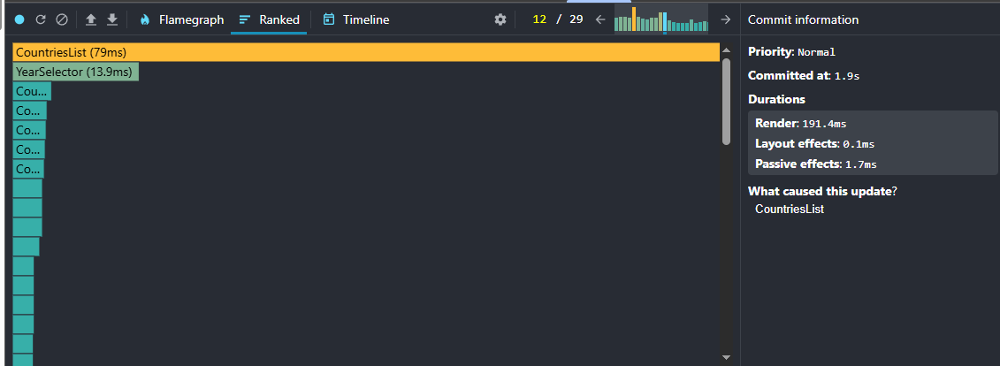

#### Ranked Chart:

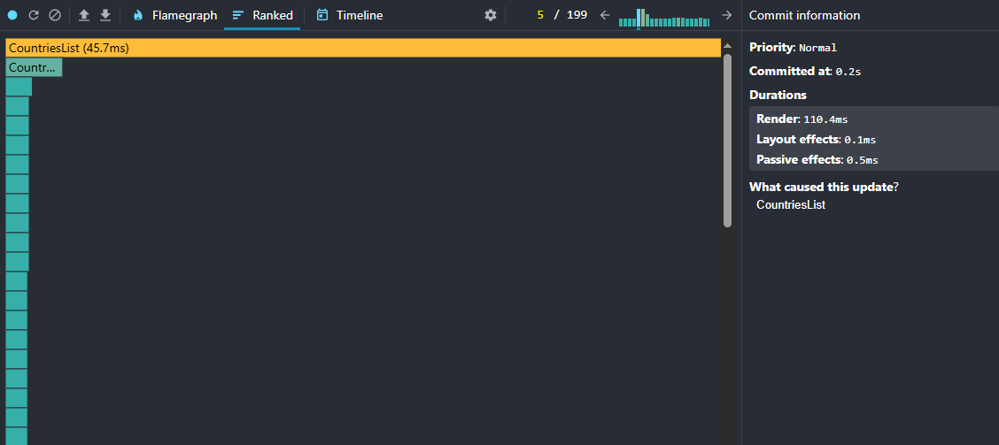

---

### Sorting by population

#### Commit Duration:

0.5s

#### Render Duration:

327.2ms

#### Interactions:

Profiler not capture interactions so only Commit and Render analyzed

#### Flame Graph:

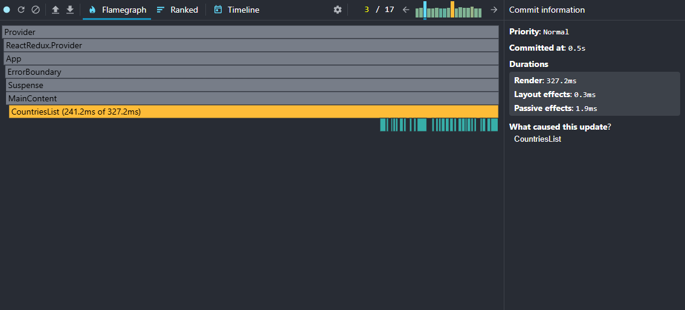

#### Ranked Chart:

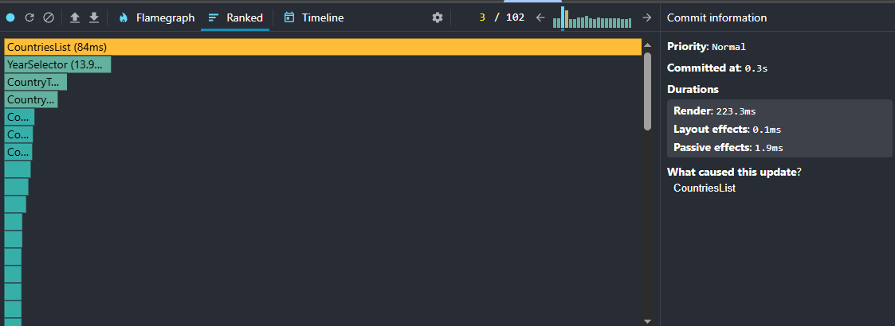

---

### Sorting by country name

#### Commit Duration:

0.9s

#### Render Duration:

320.7ms

#### Interactions:

Profiler not capture interactions so only Commit and Render analyzed

#### Flame Graph:

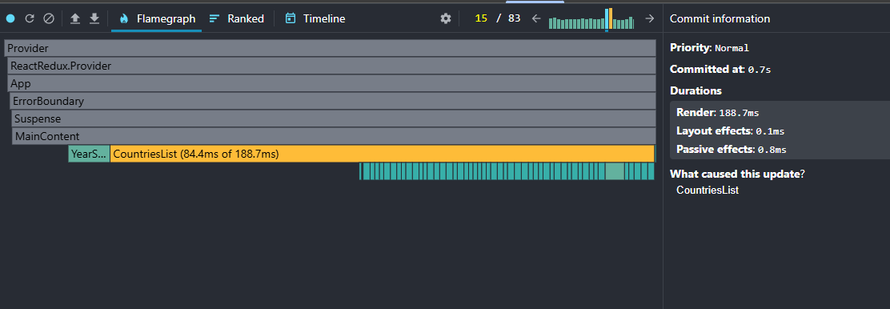

#### Ranked Chart:

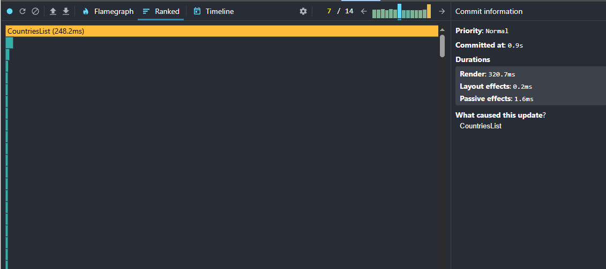

---

### Searching countries

#### Commit Duration:

0.8s

#### Render Duration:

420.3ms

#### Interactions:

Profiler not capture interactions so only Commit and Render analyzed

#### Flame Graph:

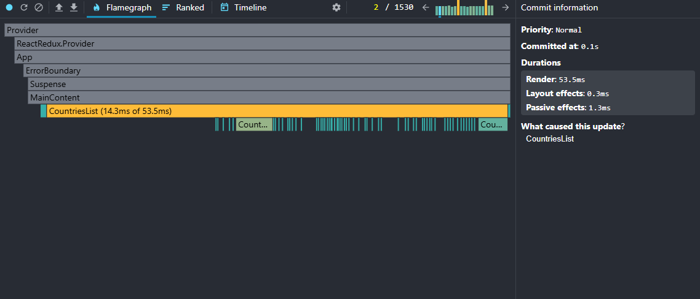

#### Ranked Chart:

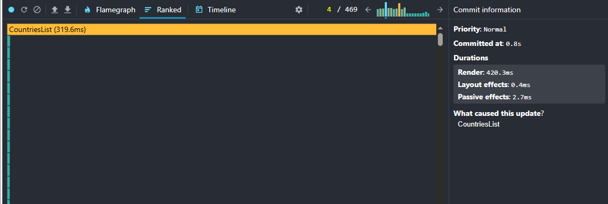

---

### Add new column

#### Commit Duration:

2.2s

#### Render Duration:

65.5ms

#### Interactions:

Profiler not capture interactions so only Commit and Render analyzed

#### Flame Graph:

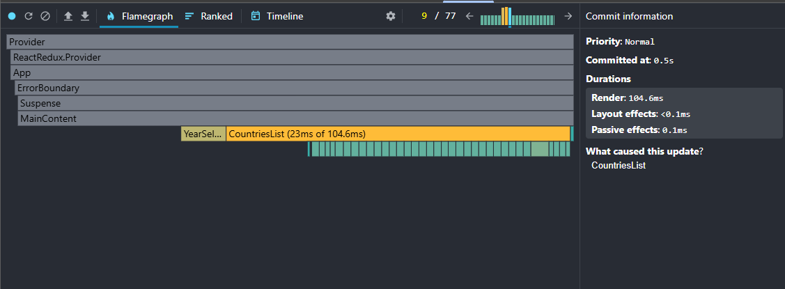

#### Ranked Chart:

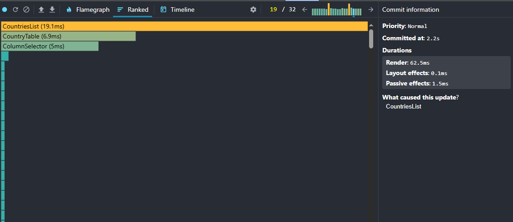

## After Optimization

### Change year selection

#### Commit Duration:

1s

#### Render Duration:

15.3ms

#### Interactions:

Profiler not capture interactions so only Commit and Render analyzed

#### Flame Graph:

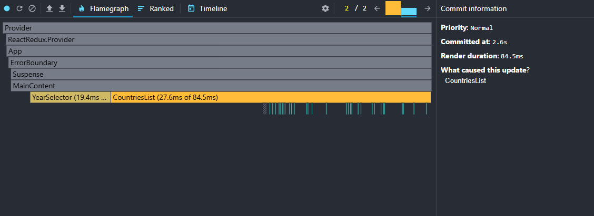

#### Ranked Chart:

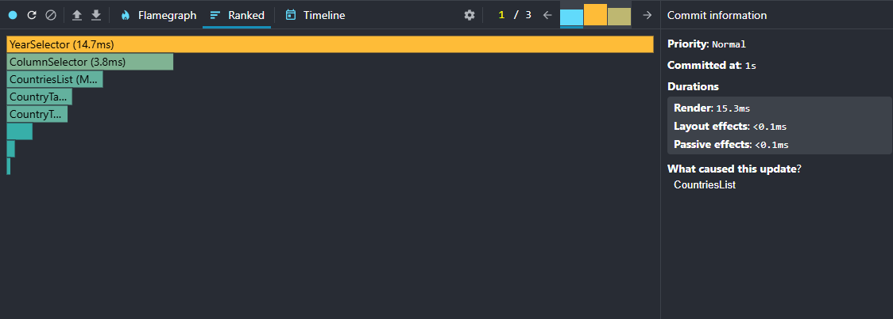

---

### Filtering by region

#### Commit Duration:

1.7s

#### Render Duration:

20.3ms

#### Interactions:

Profiler not capture interactions so only Commit and Render analyzed

#### Flame Graph:

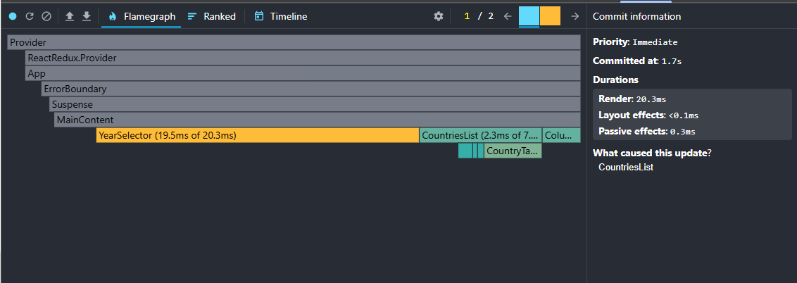

#### Ranked Chart:

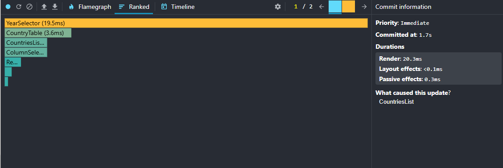

---

### Sorting by population

#### Commit Duration:

1s

#### Render Duration:

20.3ms

#### Interactions:

Profiler not capture interactions so only Commit and Render analyzed

#### Flame Graph:

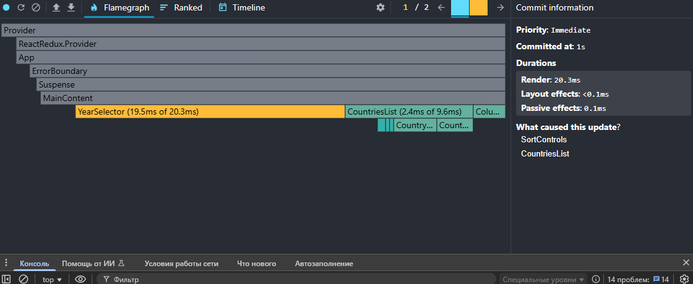

#### Ranked Chart:

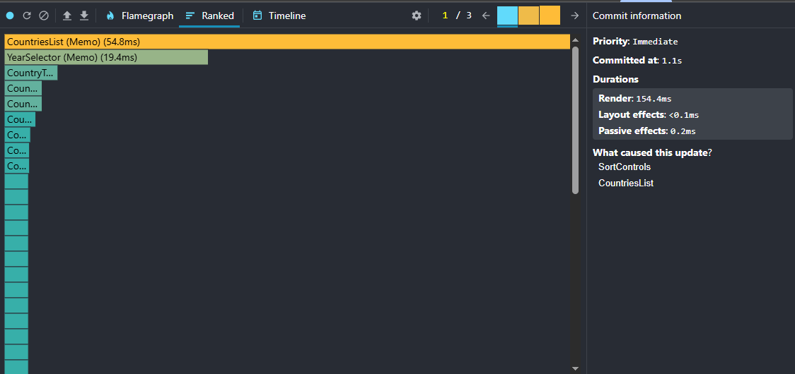

---

### Sorting by country name

#### Commit Duration:

0.9s

#### Render Duration:

20.3ms

#### Interactions:

Profiler not capture interactions so only Commit and Render analyzed

#### Flame Graph:

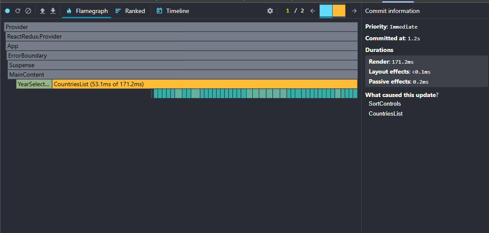

#### Ranked Chart:

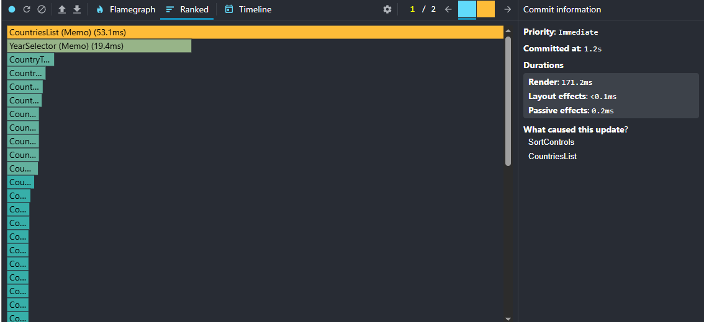

---

### Searching countries

#### Commit Duration:

1.8s

#### Render Duration:

71.6ms

#### Interactions:

Profiler not capture interactions so only Commit and Render analyzed

#### Flame Graph:

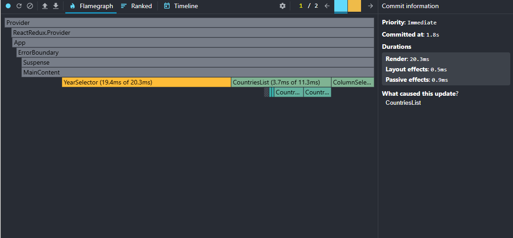

#### Ranked Chart:

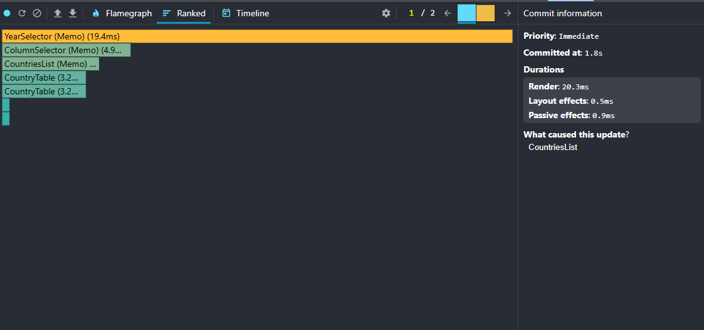

---

### Add new column

#### Commit Duration:

3.7s

#### Render Duration:

75.9ms

#### Interactions:

Profiler not capture interactions so only Commit and Render analyzed

#### Flame Graph:

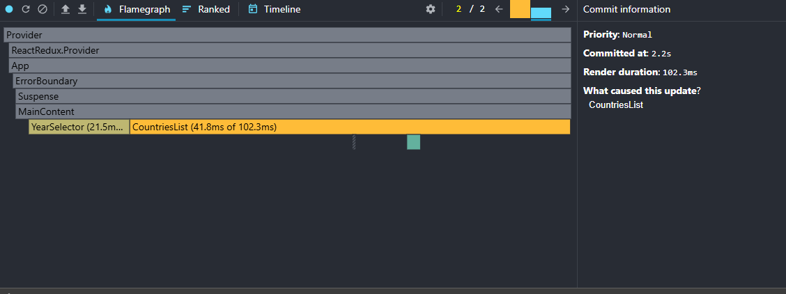

#### Ranked Chart:

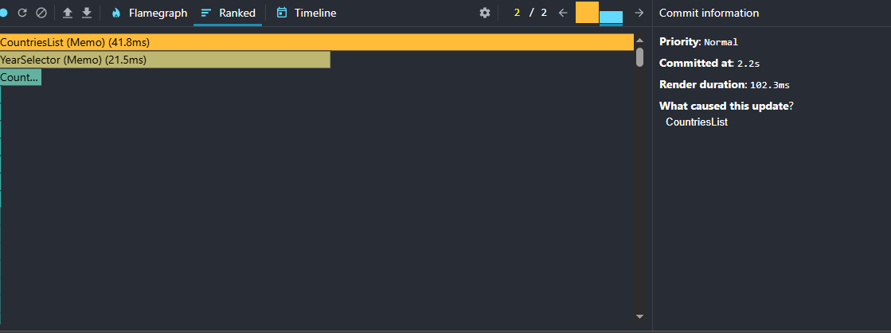

## Summary

### Table

| Interaction             | Commit Duration (before) | Commit Duration (after) | Render Duration (before) | Render Duration (after) |
| ----------------------- | ------------------------ | ----------------------- | ------------------------ | ----------------------- |
| Change year selection   | 0.8s                     | 1.0s                    | 271.2ms                  | 15.3ms                  |
| Filtering by region     | 0.2s                     | 1.7s                    | 110.4ms                  | 20.3ms                  |
| Sorting by population   | 0.5s                     | 1.0s                    | 327.2ms                  | 20.3ms                  |
| Sorting by country name | 0.9s                     | 0.9s                    | 320.7ms                  | 20.3ms                  |
| Searching countries     | 0.8s                     | 1.8s                    | 420.3ms                  | 71.6ms                  |
| Add new column          | 2.2s                     | 3.7s                    | 65.5ms                   | 75.9ms                  |
